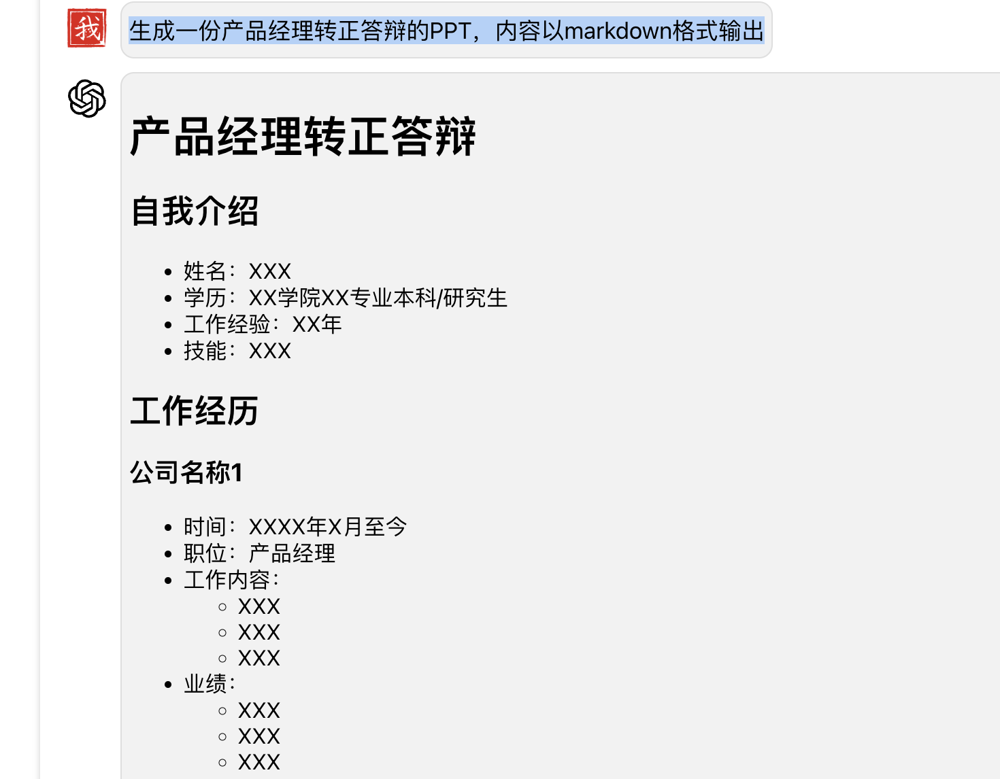
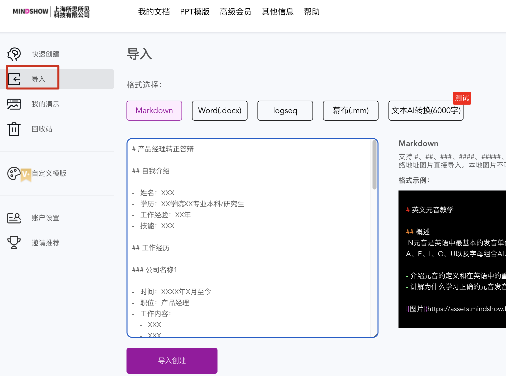

用Genie生成PPT的基本流程是先生成规范化格式的文案，借助Mindshow自动生成PPT。特别适合于有既定模式的PPT生成，如教学类的PPT，相比于传统方式需要几个小时甚至几天来绞尽脑汁写PPT，现在写一个PPT雏形可以缩短到几秒。人只需要把关关键的部分。

### 第一步：Genie生成文案

登录[Genie](https://ai.poemhub.top/)，输入Prompt，生成Markdown格式的文案，这里以产品经理转正答辩为例，输入如下的Prompt：

```
生成一份产品经理转正答辩的PPT，内容以markdown格式输出
```

具体的要求可以微调Prompt，直到生成满意的Markdown格式的文案为止。输出的内容大致如下：



### 第二步：Mindshow生成PPT

登录[Mindshow](https://mindshow.fun/)，选择导入菜单，拷贝生成的文案到创建PPT区域，点击创建即可生成PPT。如下图所示：




### 第三步：细节润色

根据要求润色具体的细节，选择PPT的主题，填入合适的文案即可。
